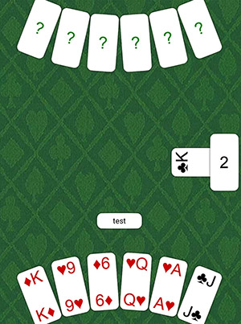

# durakmq

Сетевая игра в карты "Дурак". Для GUI использован Kivy.

Цикл статей про разработку этой игры:
1. [Геймплей и консольная версия](https://tirinox.ru/durak-game-p1/)
2. [Обнаружение соперников в локальной сети](https://tirinox.ru/%d0%b4%d1%83%d1%80%d0%b0%d0%ba-%d0%bf%d0%be-%d1%81%d0%b5%d1%82%d0%b8-%d0%bd%d0%b0-python-%d1%87%d0%b0%d1%81%d1%82%d1%8c-2-%d0%be%d0%b1%d0%bd%d0%b0%d1%80%d1%83%d0%b6%d0%b5%d0%bd%d0%b8%d0%b5/)
3. [Игра по сети](https://tirinox.ru/durak-game-p3/)
4. [Графический интерфейс, Kivy и сборка под Android](https://tirinox.ru/durak-game-p4/)



## Запуск на Android

[Установка Buildozer](https://kivy.org/doc/stable/guide/packaging-android.html)

Если у вас Mac OS, то выполните из терминала команды (можно из Terminal из PyCharm):

```pip install Cython
git clone https://github.com/kivy/buildozer.git
cd buildozer
sudo python setup.py install
```

Подключи устройство и разреши отладку по USB

Установка и запуск приложения на Android устройстве:

```buildozer android debug deploy run```

Если что-то не работает, то следует изучить логи на устройстве. Для этого есть команда:

```adb logcat -T 1 python:D "*:S"```

Она фильтрует с устройства только те логи, которые относятся к Kivy.

## ToDo

1. Перевод карты
2. Выбор, что отбить данной картой
3. Не скрывать козырь, если взяли - сделать его полупрозрачным
4. Последнюю карту из колоды не убирать вправо, а дать ее в руку
5. Подбросить карты, если сопрерник берет
